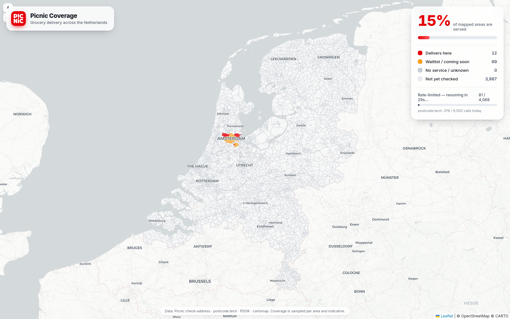

# Picnic Coverage Map 🛒🗺️

A simple map of the Netherlands that colours every **postcodegebied** (4-digit
postcode area, PC4) in **Picnic Red** (`#e5010b`) when Picnic delivers groceries
there — visualising Picnic's delivery coverage across the country.



> [!IMPORTANT]
> **Unofficial hobby project — not affiliated with Picnic.** This was vibe-coded
> together in an afternoon for fun. It is not affiliated with, endorsed by, or
> sponsored by Picnic. "Picnic" and its logo are trademarks of Picnic Technologies
> B.V., used here for identification only. Coverage is sampled and indicative — for
> real delivery availability, check [picnic.app](https://picnic.app). See
> [DISCLAIMER.md](DISCLAIMER.md).

## How it works

Picnic's `check-address` endpoint tells you, for a *valid existing address*,
whether that address is served (`waitlist_area: false`) or only on the waitlist
(`waitlist_area: true`). To paint a whole PC4 area we need one real address
inside it, so the pipeline per area is:

| Step | Source | Purpose |
|------|--------|---------|
| 1. Discover | **PDOK Locatieserver** (free, no key) | Find a real, existing `postcode + house number` inside the PC4 |
| 2. Coverage | **Picnic** `check-address` | The signal: `waitlist_area` → *delivers* / *waitlist* |
| 3. Enrich | **postcode.tech** | Authoritative validation + municipality / province / geo |
| — Cache | **Redis** | Persist every result + track the daily API budget |

The PC4 polygons come from the public [cartomap/nl](https://github.com/cartomap/nl)
GeoJSON. The browser draws them with Leaflet on a CARTO light basemap and polls
the backend, so the map fills in **live** as areas are probed.

### Coverage colours

| Colour | Meaning |
|--------|---------|
| 🔴 Picnic Red | Picnic **delivers here** (`waitlist_area: false`) |
| 🟠 Amber | **Waitlist** / coming soon (`waitlist_area: true`) |
| ⚪ Grey | No service / address not resolvable |
| ▫️ Faint | Not yet checked |

## Persistence & rate limits

Both upstreams are rate-limited, so **everything is cached in Redis** and never
re-fetched while fresh (14 days by default):

- **postcode.tech** — 10k calls/day. A per-day counter in Redis enforces a
  configurable safety cap (`POSTCODE_TECH_DAILY_LIMIT`, default 9500). Probing
  pauses enrichment when the budget is spent.
- **Picnic** — sits behind a CloudFront WAF that returns **HTTP 403 "Request
  blocked"** on bursts. The prober uses a single worker with a ~1s gap, and on a
  block it **backs off exponentially** (45s → 5 min cap), re-queues the area
  (never recording a false result), and resumes automatically when the block
  lifts.

A full sweep of ~4,000 areas therefore takes roughly an hour of gentle,
polite traffic — and survives restarts because progress lives in Redis.

## Running

Everything runs in Docker.

```bash
# Provide the postcode.tech token (already in .envrc); compose reads .env
echo "POSTCODE_TECH_API_TOKEN=<your-token>" > .env

docker compose up -d --build
open http://localhost:3000
```

The app downloads the PC4 GeoJSON on first boot (cached to `./data` and Redis)
and immediately starts probing. Watch progress in the stats panel or:

```bash
docker compose logs -f app
curl -s localhost:3000/api/status | jq
```

### Configuration (env, see `docker-compose.yml`)

| Variable | Default | Meaning |
|----------|---------|---------|
| `PROBE_ENABLED` | `true` | Start probing on boot |
| `PROBE_CONCURRENCY` | `1` | Parallel Picnic probes (keep low) |
| `PROBE_DELAY_MS` | `1100` | Delay between probes |
| `POSTCODE_TECH_DAILY_LIMIT` | `9500` | Daily postcode.tech budget |
| `CACHE_TTL_MS` | 14 days | Re-probe areas older than this |

## API

| Endpoint | Description |
|----------|-------------|
| `GET /api/geojson` | PC4 polygons (cached) |
| `GET /api/coverage` | `{ "1011": { s: "covered", city, province, … }, … }` |
| `GET /api/status` | Progress, counts, cooldown, budget |
| `POST /api/probe/start` | (Re)start a probing sweep |

## Layout

```
src/
  config.js       # env config + Redis key helpers
  redisClient.js  # ioredis connection
  sources.js      # PDOK + postcode.tech + Picnic clients, budget tracking
  geojson.js      # download/cache PC4 polygons, list PC4 codes
  prober.js       # background sweep with adaptive WAF back-off
  server.js       # Express: static frontend + JSON API
public/           # Leaflet map UI (index.html, app.js, styles.css)
```

> Coverage is **sampled** (one address per area) and therefore indicative, not a
> guarantee for every individual address within a postcode area.
