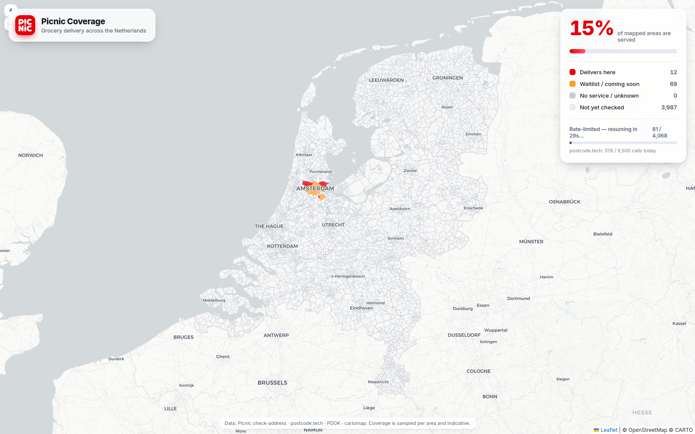

# Picnic Coverage Map 🛒🗺️

A simple map of the Netherlands that colours every **postcodegebied** (4-digit
postcode area, PC4) in **Picnic Red** (`#e5010b`) when Picnic delivers groceries
there — visualising Picnic's delivery coverage across the country.



> [!IMPORTANT]
> **Unofficial hobby project — not affiliated with Picnic.** This was vibe-coded
> together in an afternoon for fun. It is not affiliated with, endorsed by, or
> sponsored by Picnic. "Picnic" and its logo are trademarks of Picnic Technologies
> B.V., used here for identification only. Coverage is sampled and indicative — for
> real delivery availability, check [picnic.app](https://picnic.app). See
> [DISCLAIMER.md](DISCLAIMER.md).

## How it works

Picnic's `check-address` endpoint returns a `waitlist_area` flag for a *valid
existing address*. Counter-intuitively, **`waitlist_area: true` marks an area
Picnic actively serves**, and `false` marks a not-yet-served (join-the-waitlist)
area — the field name is the opposite of its real meaning (confirmed against
known delivery postcodes and the Randstad core). To paint a whole PC4 area we
need one real address inside it, so the pipeline per area is:

| Step | Source | Purpose |
|------|--------|---------|
| 1. Discover | **PDOK Locatieserver** (free, no key) | Find a real, existing `postcode + house number` inside the PC4 |
| 2. Coverage | **Picnic** `check-address` | The signal: `waitlist_area` → *delivers* / *waitlist* |
| 3. Enrich | **postcode.tech** | Authoritative validation + municipality / province / geo |
| — Cache | **Redis** | Persist every result + track the daily API budget |

The PC4 polygons come from the public [cartomap/nl](https://github.com/cartomap/nl)
GeoJSON. The browser draws them with Leaflet on a CARTO light basemap and polls
the backend, so the map fills in **live** as areas are probed.

### PC6 refinement (full-postcode detail)

One address per PC4 paints whole areas, which overstates coverage at the edge
of the delivery zone: 2461 (Ter Aar) samples as *covered* via `2461BA`, while
`2461NK` (Langeraar) has no service. So **after the PC4 sweep is complete** the
prober starts a second, slower pass that probes **every full postcode (PC6,
e.g. `2461NK`) inside covered/waitlist areas**:

- The PC4 queue always has strict priority — broad map coverage first, detail
  second. The PC6 queue is only drained while the PC4 queue is empty.
- The same breadth-before-depth idea repeats one level down. Probing every PC6
  is ~460k requests, so each area is first **sampled** (14 evenly-spaced
  postcodes, ~3% of the work) — enough to reveal *which* areas are mixed. Only
  once every area has been sampled does the prober go back and fill in the
  remaining postcodes. So the accuracy fix lands across the country in hours
  rather than after a days-long exhaustive pass.
- PC6 polygon boundaries come from **CBS via PDOK WFS** (free, CC-BY 4.0),
  fetched per PC4 and cached. Probe addresses come from PDOK, as for PC4.
- PC6 probes **skip postcode.tech** (city/province is already known per area;
  ~100+ PC6s per area would burn the daily budget for no gain).
- Per-PC4 tallies (`covered / waitlist / no-service` PC6 counts) live in a
  Redis hash. An area whose PC6s disagree renders as **partially covered**
  (red/amber stripes), and zooming in (≥ zoom 11) reveals the actual PC6
  polygons, loaded lazily per viewport.
- A full PC6 pass is ~460k probes (~5 days at one polite probe/sec), so it
  re-runs on its own slower cycle (`PC6_CACHE_TTL_MS`, default 30 days).

### Coverage colours

| Colour | Meaning |
|--------|---------|
| 🔴 Picnic Red | Picnic **delivers here** (`waitlist_area: true`) |
| 🔴🟠 Red/amber stripes | **Partially covered** — PC6 detail shows a mix (zoom in!) |
| 🟠 Amber | **Waitlist** / coming soon (`waitlist_area: false`) |
| ⚪ Grey | No service / address not resolvable |
| ▫️ Faint | Not yet checked |

## Persistence & rate limits

Both upstreams are rate-limited, so **everything is cached in Redis** and never
re-fetched while fresh (14 days by default):

- **postcode.tech** — 10k calls/day. A per-day counter in Redis enforces a
  configurable safety cap (`POSTCODE_TECH_DAILY_LIMIT`, default 9500). Probing
  pauses enrichment when the budget is spent.
- **Picnic** — sits behind a CloudFront WAF that returns **HTTP 403 "Request
  blocked"** on bursts. The prober uses a single worker with a ~1s gap, and on a
  block it **backs off exponentially** (45s → 5 min cap), re-queues the area
  (never recording a false result), and resumes automatically when the block
  lifts.

A full sweep of ~4,000 areas therefore takes roughly an hour of gentle,
polite traffic — and survives restarts because progress lives in Redis.

## Running

Everything runs in Docker.

```bash
# Provide the postcode.tech token (already in .envrc); compose reads .env
echo "POSTCODE_TECH_API_TOKEN=<your-token>" > .env

docker compose up -d --build
open http://localhost:3000
```

The app downloads the PC4 GeoJSON on first boot (cached to `./data` and Redis)
and immediately starts probing. Watch progress in the stats panel or:

```bash
docker compose logs -f app
curl -s localhost:3000/api/status | jq
```

### Configuration (env, see `docker-compose.yml`)

| Variable | Default | Meaning |
|----------|---------|---------|
| `PROBE_ENABLED` | `true` | Start probing on boot |
| `PROBE_CONCURRENCY` | `1` | Parallel Picnic probes (keep low) |
| `PROBE_DELAY_MS` | `1100` | Delay between probes |
| `POSTCODE_TECH_DAILY_LIMIT` | `9500` | Daily postcode.tech budget |
| `CACHE_TTL_MS` | 14 days | Re-probe areas older than this |
| `PC6_REFINE_ENABLED` | `true` | PC6 detail pass after the PC4 sweep |
| `PC6_CACHE_TTL_MS` | 30 days | Re-probe PC6 records older than this |

## API

| Endpoint | Description |
|----------|-------------|
| `GET /api/geojson` | PC4 polygons (cached) |
| `GET /api/coverage` | `{ "1011": { s: "covered", city, …, pc6?: {c,w,n,t} }, … }` |
| `GET /api/geojson6/:pc4` | PC6 polygons for one area (CBS via PDOK, cached) |
| `GET /api/coverage6/:pc4` | `{ "2461NK": { s: "waitlist" }, … }` |
| `GET /api/status` | Progress, counts, cooldown, budget, PC6 progress |
| `POST /api/probe/start` | (Re)start a probing sweep |

## Layout

```
src/
  config.js       # env config + Redis key helpers
  redisClient.js  # ioredis connection
  sources.js      # PDOK + postcode.tech + Picnic clients, budget tracking
  geojson.js      # download/cache PC4 polygons, list PC4 codes
  prober.js       # background sweep with adaptive WAF back-off
  server.js       # Express: static frontend + JSON API
public/           # Leaflet map UI (index.html, app.js, styles.css)
```

> Coverage is **sampled** (one address per PC4 area; one address per PC6 where
> refined) and therefore indicative, not a guarantee for every individual
> address within a postcode area.
